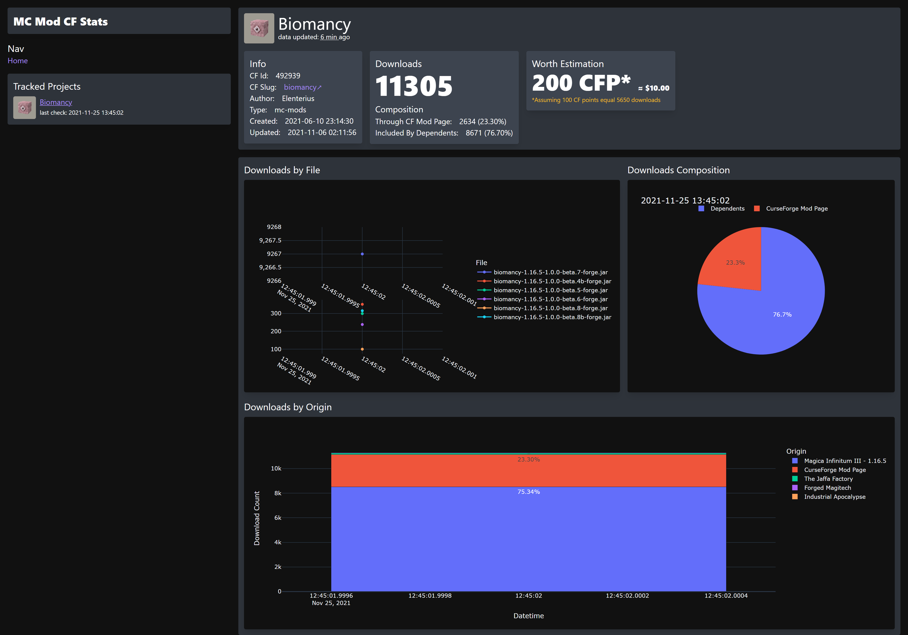

# DS-MM-CF
Get Download Stats for Minecraft Mods hosted on CurseForge

## How to get the Data
> You need a CurseForge Core API Key!

You can get the API key from https://core.curseforge.com/. 
Just login with a Google account and name your organisation with an arbitrary name, and you will automatically
get an API Key that can query mod and file data from the CFCoreAPI.

### Example
```Python
import mod_data_collector
from dependency_resolver import DependencyResolver
from save_handlers import DatasetSaveHandler
from web_apis import ApiHelper

...

cf_api_key = "YOUR_CF_CORE_API_KEY"
mod_id = 492939  # Project Id (you can find it on the cf mod page) or use the CFCoreAPI to search for the mod by name

api_helper = ApiHelper(cf_api_key)
dependency_resolver = DependencyResolver(api_helper, logger)

# save handler implementation of your choice
save_handler = DatasetSaveHandler("sqlite:///mod_stats.db", int(time.time()))

mod_data_collector.collect_data(logger, save_handler, dependency_resolver, api_helper, mod_id)
```

## Structure of Database created by DatasetSaveHandler
https://github.com/Elenterius/DS-MM-CF/blob/main/db_schema.md

## Dashboard

To view the data you can run `python dashboard_app.py` for a simple dashboard web app (built with plotly dash and tailwindcss)
which displays some simple download stats.
